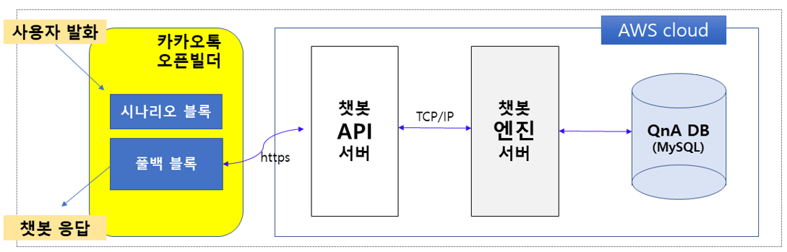

# Hiking wind-alarm 서비스 개발
자세한 내용 링크 [link](./githun_figure/TCN기반_편차보정모델.PNG)

① 소개
  - (목적) 등산객이 고려한 등산경로를 시각화하고, 신뢰성 높은 예측풍속&풍향 정보를 같이 제공함으로써, 등산객이 미리 위험바람 영역을 배재하도록 의사결정 지원하여 바람에 의한 등산사고 발생률을 줄이기 위함
  - (기능) 
    1. 사용자가 설정한 등산로 및 주변의 500m 간격의 지상 예측바람 정보 제공 
    2. 수치예보모델의 예측바람 편차보정을 통해 더 정확하고 신뢰성 있는 예측바람 정보 제공
    3. 등산로의 위험바람 발생지점을 예측하고, 경고 알림
    4. 카카오톡 채널의 챗봇을 통해 사용자의 서비스 이용 편리성 제공

② 구상동기
  - 산림데이터의 활용 서비스로 등산로 및 숲길코스 추천등이 많이 존재함
  - 산행은 여러가지 등산사고를 유발할 수 있는 위험요소를 잠재적으로 가지고 있음
  - 위험요소는 여러유형이 있으나, 겨울철 바람은 강도와 방향에 따라 직접적 또는 간접적으로 안전사고에 영향을 줄 수 있음
  - 강풍은 저체온증을 유발하고, 눈보라를 일으켜 시정을 악화시켜 등산로 확인을 어렵게 만들고, 등산사고 발생시 구조작업 또한 어렵게 만듦
  - 바람의 방향 또한 중요한데, 우리나라의 겨울철은 시베리아로부터 불어오는 찬바람 '북서풍'은 체온유지를 어렵게 만들기 때문에 산능선을 따라 이동시 주의 해야함
  - 이렇게 산행은 잠재적인 위험요소를 가지고 있는데 이를 미리 경고해주는 서비스는 많이 없음
  - 서비스 개발 과정에는 여러가지 어려움이 있겠지만 도전의식을 가지고 조금이나마 산행에 도움이 되고자 하며, 지속적으로 개선하여 바람뿐만 아니라 여러 위험요소들을 알리는 서비스로 발전할 수 있다고 봄

③ 기대효과
  - 우리나라 겨울철 산악지역에서 바람(풍속, 풍향)으로 인해 발생하는 재난 사건을 줄일 수 있을 것으로 기대
    - 등산로의 위험바람 영역 예측 및 경고알림, 위험바람 영역에 따른 등산로 수정을 제안
      --> 안전사고에 대한 경각심 유발, 안전사고 예방

  

# 서비스 구성
* 카카오톡 및 챗봇을 통한 서비스 운영
  1. 카카오톡 채널 추가 후, 대화를 통해 서비스 제공
  2. 고객의 등산로 검색 --> 등산로 경로 지도 html 리턴
  3. 고객의 등산 시작시각 검색 --> 등산로 경로 주변 예상 바람장 png 리턴
* 구동환경: AWS lightsail, Ubuntu(1GBRAM, 2 vCPU, 40GB SSD, swap 4GB)

  
  <b>3단계 서비스 구성</b>  

  

# 서비스 핵심기술
## 편차보정 시스템
* 입력자료 준비: 수치예보모델(기상청 국지예보모델, LDAPS)의 예측 격자자료로 부터 지점 시계열 자료 추출
* 편차보정모델을 통해 지점예측 시계열자료를 보정
* 두자료(수치예보모델의 격자 예측자료, 보정된 지점 예측자료)를 객관분석

  
  <b>0.005˚×0.005˚ 해상도 바람 예측장 생산과정</b>  

* 편차보정모델 개발과정
  * 입력변수 최적화: 2단계 필터( 1.변수중요도 분석, 2.상관행렬 분석 )
  * 
  * 자료분할: 층화 및 계층적 추출법을 사용한 train data set의 분포 유지
  * 
  * TCN 기반 편차보정 구도 설정
  * 
  * Hyper-parameter 최적화: Bayesian Optimization VS HyperBand
  * 
* 편차보정모델 보정 전,후 검증
  * 

  

## 챗봇 시스템
* 카카오톡 오픈빌더의 풀백 블록을 이용해 사용자가 발화한 서비스 조회내용을 챗봇서버(API --> engien --> DB)로 전달하여 응답리턴

  
  <b>챗봇 시스템 응답과정</b>  

* 챗봇모델 개발과정
  * 말뭉치 훈련자료
  * 
  * 등산로 자료
  * 
  * 의도분류 모델
  * 
  * 개체명인식 모델
  * 
  * 검증
  * 
